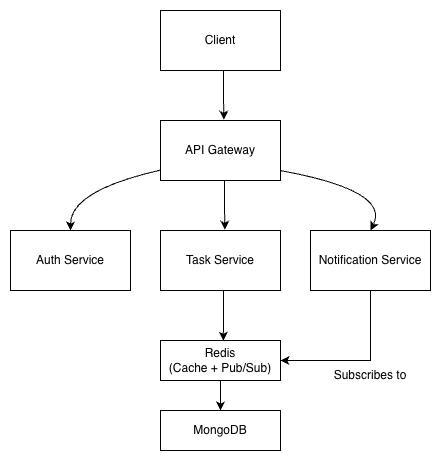

# Cloud-Native Task Management System

A **cloud-ready task management backend** built using **microservices architecture**.
The system is composed of multiple independent services communicating through an **API Gateway**, with **Redis caching and Pub/Sub messaging** for scalable communication.

This project demonstrates **modern backend engineering practices**, including service isolation, event-driven communication, and containerized deployment.

---

# Architecture

All client requests pass through a centralized **API Gateway**, which routes them to individual microservices.

## System Architecture



### Architecture Overview

* **API Gateway** → Routes incoming requests to microservices
* **Auth Service** → Handles authentication and JWT tokens
* **Task Service** → Manages task CRUD operations
* **Notification Service** → Listens for task events
* **Redis** → Used for caching and Pub/Sub messaging
* **MongoDB** → Persistent data storage

---

# Tech Stack

### Backend

* Node.js
* Express.js

### Database

* MongoDB

### Caching & Messaging

* Redis
* Redis Pub/Sub

### Infrastructure

* Docker
* Docker Compose

### Authentication

* JWT (JSON Web Tokens)

---

# Microservices

## Auth Service

Responsible for user authentication and authorization.

Features

* User registration
* Login
* JWT token generation
* Protected routes

Runs on

```
http://localhost:5001
```

---

## Task Service

Handles task management functionality.

Features

* Create tasks
* Fetch tasks
* Redis caching
* Publish task events

Runs on

```
http://localhost:5002
```

---

## Notification Service

Subscribes to Redis Pub/Sub events and processes notifications.

Example event log:

```
New Task Event Received
Task: Finish Cloud Project
Assigned to: Siddhant
```

---

## API Gateway

Acts as the **central entry point** for all client requests.

Responsibilities

* Routing requests to services
* Simplifying client communication
* Centralizing API access

Runs on

```
http://localhost:5003
```

---

# API Endpoints

## Register User

POST `/auth/register`

```
{
  "name": "Siddhant",
  "email": "siddhant@test.com",
  "password": "123456"
}
```

---

## Login

POST `/auth/login`

Response

```
{
  "token": "JWT_TOKEN"
}
```

---

## Create Task

POST `/tasks`

Headers

```
Authorization: Bearer TOKEN
```

Body

```
{
  "title": "Finish Cloud Project",
  "description": "Complete microservices backend",
  "assignedTo": "Siddhant"
}
```

---

## Get Tasks

GET `/tasks`

Example logs showing caching:

```
Serving from MongoDB
Serving from Redis Cache
```

Redis caching reduces repeated database queries and improves performance.

---

# Running Locally

Clone the repository

```
git clone <repository-url>
cd cloud-task-manager
```

Start all services using Docker

```
docker compose up --build
```

---

# Services

After starting Docker containers, the services will run on:

```
Auth Service → http://localhost:5001
Task Service → http://localhost:5002
API Gateway → http://localhost:5003
MongoDB → localhost:27017
Redis → localhost:6379
```

---

# Key Features

* Microservices architecture
* API Gateway routing
* JWT authentication
* Redis caching
* Redis Pub/Sub messaging
* Docker containerization
* Event-driven notifications

---

# Author

Siddhant Chasta
IIT Kharagpur

